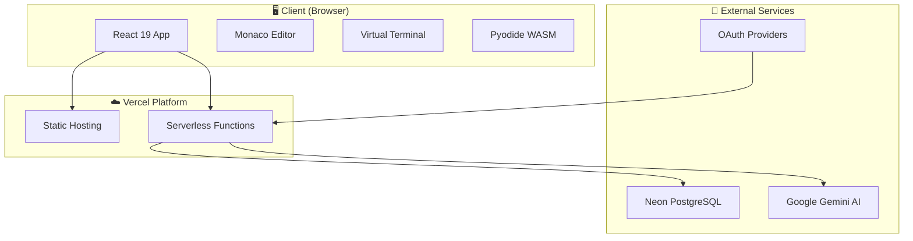
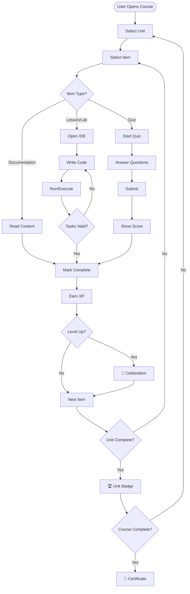
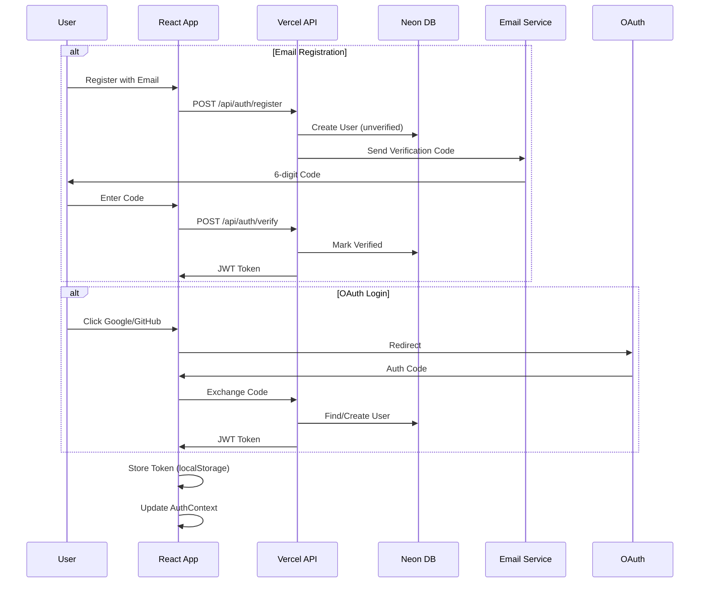
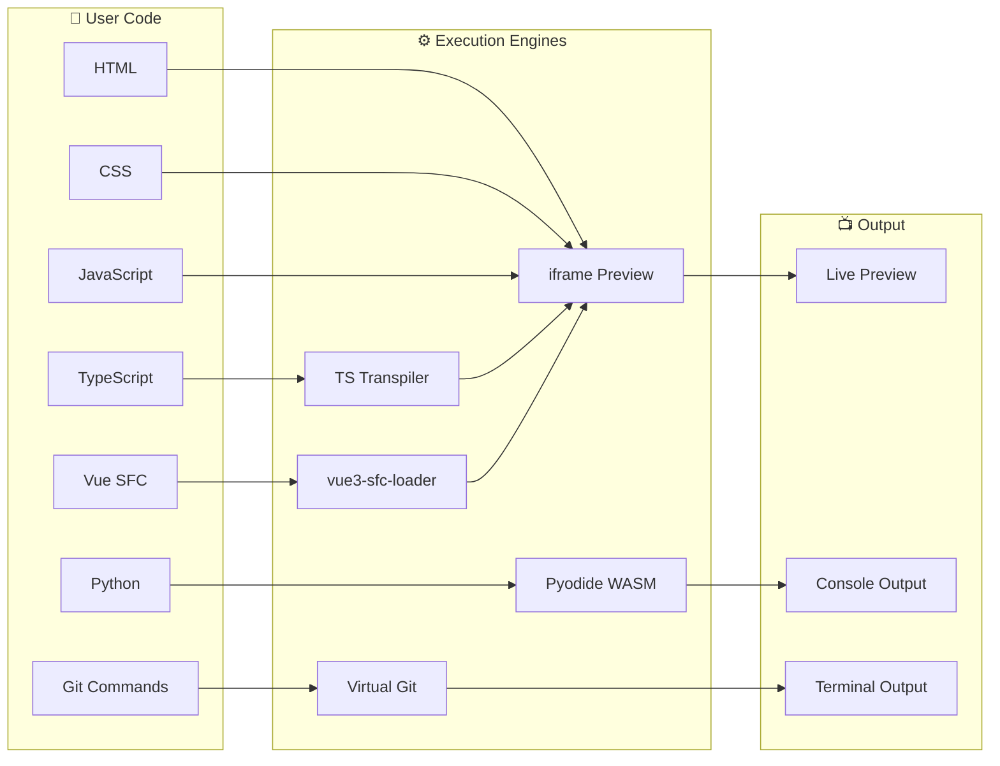
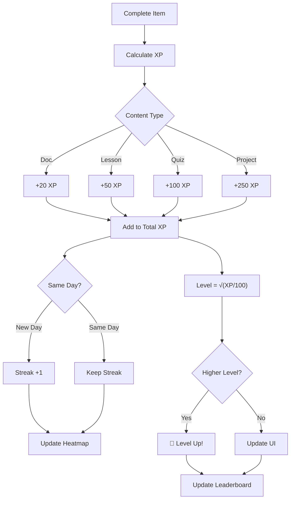
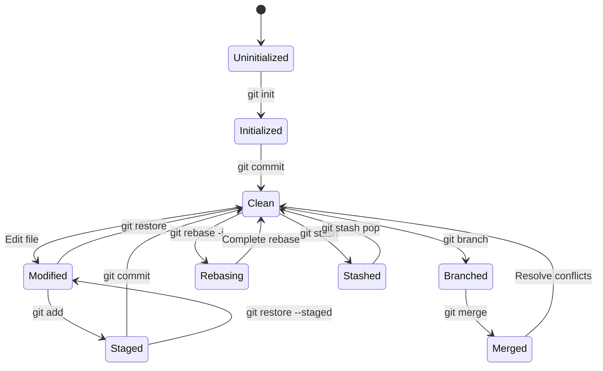
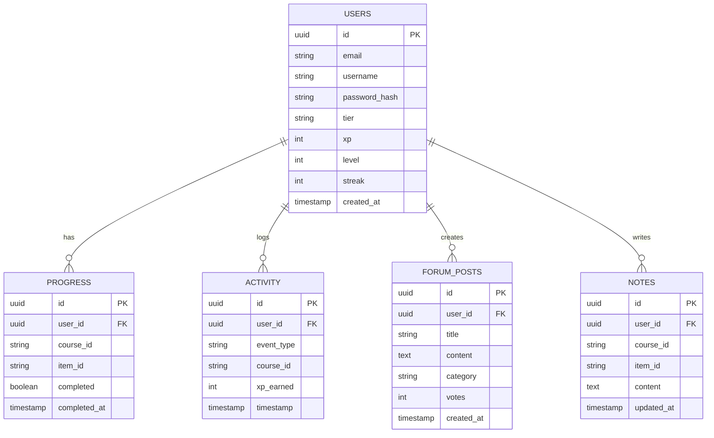
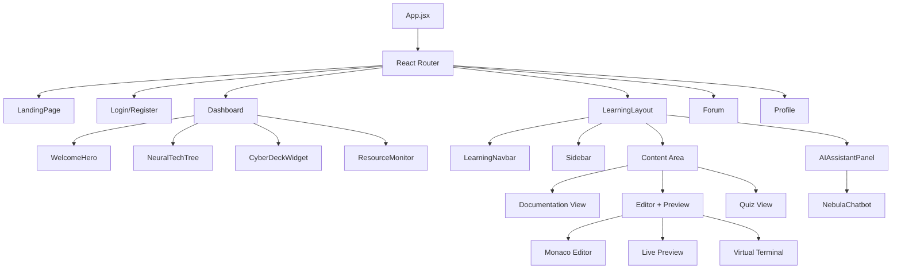

# ZeroCode Architecture Flowcharts

## 🏗️ System Architecture Overview

---

## 📚 Course Learning Flow

---

## 🔐 Authentication Flow

---

## 💻 Code Execution Engines

---

## 🎮 Gamification System

---

## 🗺️ Specialization Tracks

```mermaid
graph LR
    subgraph Frontend["🎨 Frontend Protocol"]
        F1[HTML5] --> F2[CSS3]
        F2 --> F3[JS Basics]
        F3 --> F4[Tailwind]
        F4 --> F5[DOM]
        F5 --> F6[ES6+]
        F6 --> F7[React]
        F7 --> F8[TypeScript]
        F8 --> F9[Vue.js]
        F9 --> F10[Next.js]
    end

    subgraph Backend["⚙️ Backend Protocol"]
        B1[JS Basics] --> B2[Node.js]
        B2 --> B3[Express]
        B3 --> B4[PHP]
        B4 --> B5[PostgreSQL]
        B5 --> B6[MySQL]
        B6 --> B7[MongoDB]
        B7 --> B8[Python]
        B8 --> B9[TypeScript]
        B9 --> B10[CI/CD]
    end

    subgraph FullStack["🚀 Full-Stack Operative"]
        FS1[HTML5] --> FS2[CSS3]
        FS2 --> FS3[JS Basics]
        FS3 --> FS4[Git]
        FS4 --> FS5[React]
        FS5 --> FS6[Node.js]
        FS6 --> FS7[Express]
        FS7 --> FS8[MongoDB]
        FS8 --> FS9[Next.js]
        FS9 --> FS10[CI/CD]
    end
```

---

## 🔄 Virtual Git State Machine

---

## 📊 Database Schema (Simplified)

---

## 🖥️ Component Hierarchy

